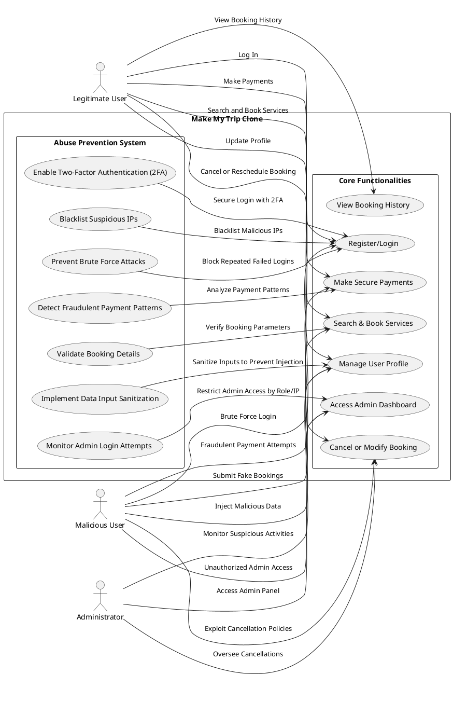
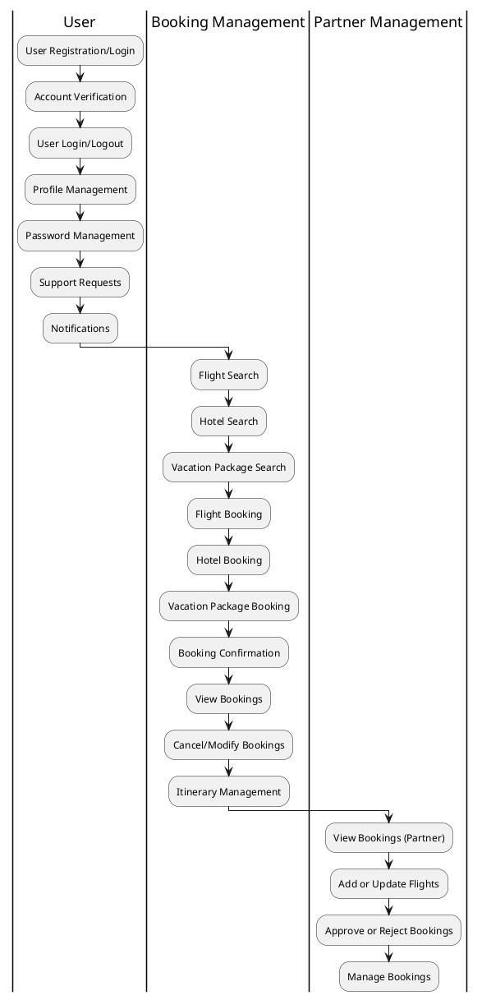

# Specification (SRS) for "Make My Trip" Clone

## 1. Introduction

### 1.1 Purpose
This Software Requirements Specification (SRS) document outlines the requirements for the development of a web and mobile application clone of "Make My Trip". The system will enable users to search, book, and manage travel services such as flights, hotels, and car rentals efficiently. The document serves as a comprehensive guide for developers, designers, and stakeholders to ensure clarity of expectations.

### 1.2 Scope
The application will provide the following features:
- User registration and authentication (including social login options).
- Comprehensive search and booking capabilities for flights, hotels, and car rentals.
- Payment processing integration with major payment gateways.
- Profile management for users to track bookings and update details.
- Administrative dashboard for managing users, content, and transactions.
- Compliance with GDPR and other security standards to ensure data protection.

### 1.3 Definitions, Acronyms, and Abbreviations
- **MMT**: Make My Trip  
- **UI**: User Interface  
- **API**: Application Programming Interface  
- **GDPR**: General Data Protection Regulation  
- **2FA**: Two-Factor Authentication  
- **OAuth2**: Open Authorization Protocol  

### 1.4 References
- **SWEBOK**: Software Engineering Body of Knowledge  
- **IEEE 830**: IEEE Recommended Practice for Software Requirements Specifications  
- **WCAG 2.1**: Web Content Accessibility Guidelines  

### 1.5 Overview
This document outlines both functional and non-functional requirements. Functional requirements specify the system's operations and features, while non-functional requirements focus on performance, usability, and compliance.

---

## 2. Overall Description

### 2.1 Product Perspective
The system will be a full-stack solution combining a web-based interface and mobile application. It will integrate with third-party APIs for accessing real-time data on flights, hotels, and car rentals. The platform will emphasize ease of use, security, and scalability to handle high traffic and large datasets.

### 2.2 Product Functions
#### Key Features:
- **Registration/Login**: Secure user account management with social login options.
- **Search**: Intuitive search filters for travel services (flights, hotels, car rentals).
- **Booking**: Secure booking with confirmation emails and in-app notifications.
- **Payments**: Integration with payment gateways for secure and varied payment options.
- **Profile Management**: Enable users to update personal information and view booking history.
- **Admin Tools**: Comprehensive dashboard for managing user data, bookings, and system content.

### 2.3 User Classes and Characteristics
1. **End Users**: General customers who search, book, and manage travel plans.
   - Characteristics: Non-technical, diverse preferences, need user-friendly interfaces.
2. **Admins**: Platform managers who handle backend processes.
   - Characteristics: Technical background, access to secure admin tools.

### 2.4 Operating Environment
- **Frontend**: Web browsers (Chrome, Firefox, Safari) and mobile platforms (iOS, Android).  
- **Backend**: Cloud-hosted web servers with database management systems.  
- **APIs**: Integration with third-party services (e.g., flight/hotel databases).  

### 2.5 Design and Implementation Constraints
- **Third-Party Dependencies**: Reliance on APIs for travel data.  
- **Security Regulations**: Must comply with GDPR and local data protection laws.  
- **Performance Goals**: The system must scale for up to 10,000 concurrent users.  

### 2.6 Assumptions and Dependencies
- Reliable internet connectivity for seamless user experiences.  
- Third-party API availability and reliability.  
- Adherence to evolving legal and regulatory frameworks.  

---

## 3. Functional Requirements

### *Use Cases*

#### *Use Case 1: User Registration/Login*
- *Actors*: User  
- *Goal*: Allows users to create accounts or log in using email or social accounts.  
- *Precondition*: User provides valid credentials.  
- *Postcondition*: User gains access to the platform.  
- *Flow*:  
  - User enters credentials.  
  - System validates credentials.  
  - User is redirected to the dashboard.  
- *Alternative Flow*:  
  - Invalid credentials trigger an error message.  
  - Account lock after five failed attempts.  


#### *Use Case 2: Account Verification*
- *Actors*: User  
- *Goal*: Allows users to verify their account via email or SMS to confirm their identity.  
- *Precondition*: User has successfully registered.  
- *Postcondition*: User's account is verified.  
- *Flow*:  
  - User receives a verification email or SMS.  
  - User clicks on the verification link or enters the SMS code.  
  - System verifies the code and activates the account.  
- *Alternative Flow*:  
  - Invalid or expired verification code results in an error message.  


#### *Use Case 3: User Login/Logout*
- *Actors*: User  
- *Goal*: Allows users to securely log in and log out of the platform.  
- *Precondition*: User has an active account.  
- *Postcondition*: User is logged in or logged out successfully.  
- *Flow*:  
  - User enters credentials and submits.  
  - System validates the credentials and logs the user in.  
  - On logout, the system logs the user out and redirects to the login page.  
- *Alternative Flow*:  
  - Invalid credentials trigger an error message.  


#### *Use Case 4: Profile Management*
- *Actors*: User  
- *Goal*: Allows users to view and update their personal information, including contact details and payment methods.  
- *Precondition*: User is logged in.  
- *Postcondition*: User's profile is updated with the new information.  
- *Flow*:  
  - User navigates to the profile section.  
  - User updates personal details, including contact information and payment methods.  
  - System saves the updated information.  
- *Alternative Flow*:  
  - Invalid input triggers an error message.  


#### *Use Case 5: Password Management*
- *Actors*: User  
- *Goal*: Allows users to reset their password and recover their account.  
- *Precondition*: User has an active account.  
- *Postcondition*: User's password is successfully reset.  
- *Flow*:  
  - User clicks on 'Forgot Password.'  
  - User enters email or mobile number for verification.  
  - User receives a reset code via email or SMS.  
  - User enters the code to reset the password.  
- *Alternative Flow*:  
  - Invalid or expired reset code triggers an error message.  


#### *Use Case 6: Flight Search*
- *Actors*: Flight Booking User  
- *Goal*: Allows users to search for flights based on various criteria such as departure and arrival cities, dates, number of passengers, and class of service.  
- *Precondition*: User is logged in.  
- *Postcondition*: User views a list of flights based on search criteria.  
- *Flow*:  
  - User enters search criteria for flight search.  
  - System fetches available flight results.  
  - User views the results and selects a preferred flight.  
- *Alternative Flow*:  
  - No available flights for the given search criteria triggers a 'No results' message.  


#### *Use Case 7: Hotel Search*
- *Actors*: Hotel Booking User  
- *Goal*: Allows users to search for hotels based on location, check-in/check-out dates, and guest details.  
- *Precondition*: User is logged in.  
- *Postcondition*: User views a list of hotels based on search criteria.  
- *Flow*:  
  - User enters hotel search criteria.  
  - System fetches available hotels based on the criteria.  
  - User views the results and selects a hotel.  
- *Alternative Flow*:  
  - No available hotels for the given search criteria triggers a 'No results' message.  


#### *Use Case 8: Vacation Package Search*
- *Actors*: User  
- *Goal*: Allows users to search for vacation packages including flights, hotels, and activities.  
- *Precondition*: User is logged in.  
- *Postcondition*: User views a list of vacation packages based on search criteria.  
- *Flow*:  
  - User enters vacation package search criteria.  
  - System fetches available vacation packages.  
  - User views the results and selects a package.  
- *Alternative Flow*:  
  - No available vacation packages for the given search criteria triggers a 'No results' message.  


#### *Use Case 9: Flight Booking*
- *Actors*: Flight Booking User  
- *Goal*: Allows users to book a flight by selecting a preferred flight, entering passenger details, and completing the payment.  
- *Precondition*: User has selected a flight.  
- *Postcondition*: User receives a booking confirmation email/SMS with booking details.  
- *Flow*:  
  - User selects a flight and enters passenger details.  
  - User selects seat preferences.  
  - User proceeds to payment and completes the transaction.  
  - System confirms the booking and sends a confirmation email/SMS.  
- *Alternative Flow*:  
  - Invalid payment details trigger an error message.  


#### *Use Case 10: Hotel Booking*
- *Actors*: Hotel Booking User  
- *Goal*: Allows users to book a hotel room by selecting a preferred room, entering guest details, and completing the payment.  
- *Precondition*: User has selected a hotel room.  
- *Postcondition*: User receives a booking confirmation email/SMS with booking details.  
- *Flow*:  
  - User selects a room type and enters guest details.  
  - User proceeds to payment and completes the transaction.  
  - System confirms the booking and sends a confirmation email/SMS.  
- *Alternative Flow*:  
  - Invalid payment details trigger an error message.  


#### *Use Case 11: Vacation Package Booking*
- *Actors*: User  
- *Goal*: Allows users to book a vacation package by selecting a preferred package, entering details, and completing the payment.  
- *Precondition*: User has selected a vacation package.  
- *Postcondition*: User receives a booking confirmation email/SMS with booking details.  
- *Flow*:  
  - User selects a vacation package and customizes options.  
  - User enters booking details.  
  - User proceeds to payment and completes the transaction.  
  - System confirms the booking and sends a confirmation email/SMS.  
- *Alternative Flow*:  
  - Invalid payment details trigger an error message.  


#### *Use Case 12: Booking Confirmation*
- *Actors*: User  
- *Goal*: Allows users to receive booking confirmations via email/SMS after completing a booking.  
- *Precondition*: User has completed a booking.  
- *Postcondition*: User receives booking confirmation details.  
- *Flow*:  
  - User completes booking.  
  - System sends a booking confirmation email/SMS with booking details.  
  - User is provided with a downloadable PDF of the booking confirmation.  
- *Alternative Flow*:  
  - System failure triggers a booking confirmation error message.  


#### *Use Case 13: View Bookings*
- *Actors*: User  
- *Goal*: Allows users to view details of their current and past bookings.  
- *Precondition*: User is logged in.  
- *Postcondition*: User views booking details.  
- *Flow*:  
  - User navigates to the booking history section.  
  - User selects a booking to view details.  
  - System displays booking information.  
- *Alternative Flow*:  
  - No bookings found triggers a 'No bookings' message.  


#### *Use Case 14: Cancel/Modify Bookings*
- *Actors*: User  
- *Goal*: Allows users to cancel or modify bookings according to the provider’s policy.  
- *Precondition*: User has an active booking.  
- *Postcondition*: User’s booking status is updated after cancellation or modification.  
- *Flow*:  
  - User selects a booking to modify or cancel.  
  - User modifies the booking details or requests cancellation.  
  - System updates the booking status accordingly.  
- *Alternative Flow*:  
  - Cancellation/modification not allowed triggers an error message.  


#### *Use Case 15: Itinerary Management*
- *Actors*: User  
- *Goal*: Allows users to view and manage their travel itineraries.  
- *Precondition*: User has a confirmed booking.  
- *Postcondition*: User’s itinerary is updated.  
- *Flow*:  
  - User navigates to the itinerary section.  
  - User adds notes, tracks changes, and views details.  
  - System updates the itinerary in real-time.  
- *Alternative Flow*:  
  - No itinerary found triggers an error message.  


#### *Use Case 16: Payment Processing*
- *Actors*: User  
- *Goal*: Allows users to make secure payments for bookings.  
- *Precondition*: User has selected a service (flight, hotel, package) and is ready to pay.  
- *Postcondition*: User’s payment is processed securely.  
- *Flow*:  
  - User selects a payment method.  
  - User enters payment details.  
  - System processes the payment securely.  
  - User receives payment confirmation.  
- *Alternative Flow*:  
  - Payment failure triggers an error message.  


#### *Use Case 17: Support Requests*
- *Actors*: User  
- *Goal*: Allows users to access support channels and create tickets for issues or queries.  
- *Precondition*: User is logged in.  
- *Postcondition*: User’s support request is created or resolved.  
- *Flow*:  
  - User accesses the support section.  
  - User creates a support ticket.  
  - System tracks and updates ticket status.  
- *Alternative Flow*:  
  - No tickets found triggers a 'No tickets' message.  


#### *Use Case 18: Notifications*
- *Actors*: User  
- *Goal*: Allows users to receive email/SMS and in-app notifications for booking updates and special offers.  
- *Precondition*: User has active bookings.  
- *Postcondition*: User receives relevant notifications.  
- *Flow*:  
  - User receives notifications via email/SMS and in-app.  
  - User views the notification details.  
- *Alternative Flow*:  
  - No new notifications triggers a 'No new notifications' message.  


#### *Use Case 19: View Bookings (Partner)*
- *Actors*: Travel Booking Partner  
- *Goal*: Allows travel partners (e.g., airlines, hotels) to view bookings related to their services.  
- *Precondition*: Partner is logged in and has access to relevant bookings.  
- *Postcondition*: Partner views relevant booking details.  
- *Flow*:  
  - Partner accesses the booking section.  
  - Partner applies filters such as customer name, booking ID, and travel dates.  
  - System displays filtered booking results.  
- *Alternative Flow*:  
  - No bookings found triggers a 'No bookings' message.  


#### *Use Case 20: Add/Update Flights (Partner)*
- *Actors*: Travel Booking Partner  
- *Goal*: Allows travel partners to add or update flight details.  
- *Precondition*: Partner is logged in and has permissions to manage flights.  
- *Postcondition*: Flight details are successfully added or updated.  
- *Flow*:  
  - Partner adds or selects an existing flight.  
  - Partner enters or updates flight details.  
  - System reflects the changes immediately.  
- *Alternative Flow*:  
  - Invalid flight details trigger an error message.  


#### *Use Case 21: Approve/Reject Bookings (Partner)*
- *Actors*: Travel Booking Partner  
- *Goal*: Allows travel partners to approve or reject bookings based on availability.  
- *Precondition*: Partner has received a booking request.  
- *Postcondition*: Booking status is updated.  
- *Flow*:  
  - Partner reviews booking details.  
  - Partner approves or rejects the booking.  
  - System updates the booking status and notifies the user.  
- *Alternative Flow*:  
  - Booking rejection triggers a 'Booking Rejected' message.  


#### *Use Case 22: Manage Bookings (Partner)*
- *Actors*: Travel Booking Partner  
- *Goal*: Allows travel partners to manage bookings, including modifications and cancellations.  
- *Precondition*: Partner has an active booking.  
- *Postcondition*: Partner updates or cancels bookings.  
- *Flow*:  
  - Partner selects a booking to manage.  
  - Partner modifies or cancels the booking.  
  - System reflects the changes in real-time.  
- *Alternative Flow*:  
  - Cancellation/modification not allowed triggers an error message.

--- 

### USECASE DIAGRAM


```PlantUml
@startuml
actor "Customer" as Customer
actor "Travel Agent" as Agent
actor "Payment Gateway" as PG
actor "Admin" as Admin

rectangle "MakeMyTrip System" as MakeMyTrip {
  usecase "Search Flights/Hotels" as Search
  usecase "Book Flights/Hotels" as Book
  usecase "Cancel Booking" as Cancel
  usecase "View Booking History" as History
  usecase "Manage Account" as Manage
  usecase "Apply Promo Code" as Promo
  usecase "Generate Reports" as Reports
  usecase "Assist Customer" as Assist
  usecase "Handle Refunds" as Refund
}

Customer --> Search : "Initiate Search"
Customer --> Book : "Proceed to Book"
Customer --> Cancel : "Request Cancellation"
Customer --> History : "Access Booking History"
Customer --> Manage : "Update Profile"
Customer --> Promo : "Apply Discounts"

Agent --> Search : "Perform Search"
Agent --> Book : "Assist Booking"
Agent --> Assist : "Provide Support"

Book --> PG : "Process Payment"
Book --> Promo : "Validate Promo Code"
Cancel --> Refund : "Initiate Refund"

Admin --> Reports : "Analyze Data"
Admin --> Assist : "Resolve Issues"
Admin --> Refund : "Approve Refunds"
@enduml
```
## 4. Error Cases

### Use Cases for Error Scenarios
#### **Authentication Errors**
- **Invalid Credentials**: User enters invalid login credentials.
- **Account Locked After Repeated Failures**: User is locked out after multiple incorrect login attempts.
- **Session Timeout**: User session expires due to inactivity.
- **2FA Code Expired**: Two-Factor Authentication code has expired.

#### **Booking Errors**
- **Invalid Search Criteria**: Invalid search filters or criteria entered by the user.
- **Overbooking**: The booking fails due to no available capacity for the selected service.
- **API Failure for External Services**: The system fails to retrieve data from external services (e.g., flight, hotel).
- **Incomplete Booking Details**: Missing or incomplete information required for booking.

#### **Payment Errors**
- **Card Declined**: Payment is declined by the user's bank or card issuer.
- **Insufficient Funds**: The user does not have enough funds for the transaction.
- **Payment Gateway Timeout**: The payment gateway times out while processing the transaction.
- **Duplicate Transaction**: A duplicate payment is detected.

#### **Admin Errors**
- **Unauthorized Admin Access Attempt**: A malicious user attempts to gain unauthorized admin access.
- **Failure to Load Reports**: Admin is unable to load reports due to system errors or maintenance.
- **Error in User Management Actions**: An admin encounters issues while managing users.
- **Data Sync Issues with Backup Server**: The system encounters problems syncing data with the backup server.

---
 
```PlantUml
@startuml
left to right direction

actor "Legitimate User" as User
actor "Malicious User" as Attacker
actor "Administrator" as Admin

rectangle "Make My Trip Clone  " {
    rectangle "Core Functionalities" as CF {
        usecase "Register/Login" as UC1
        usecase "Search & Book Services" as UC2
        usecase "Make Secure Payments" as UC3
        usecase "Access Admin Dashboard" as UC4
        usecase "Cancel or Modify Booking" as UC5
        usecase "View Booking History" as UC6
        usecase "Manage User Profile" as UC7
    }

    rectangle "Abuse Prevention System" as APS {
        usecase "Prevent Brute Force Attacks" as APS1
        usecase "Validate Booking Details" as APS2
        usecase "Detect Fraudulent Payment Patterns" as APS3
        usecase "Monitor Admin Login Attempts" as APS4
        usecase "Blacklist Suspicious IPs" as APS5
        usecase "Enable Two-Factor Authentication (2FA)" as APS6
        usecase "Implement Data Input Sanitization" as APS7
    }
}

User --> UC1 : "Log In"
User --> UC2 : "Search and Book Services"
User --> UC3 : "Make Payments"
User --> UC5 : "Cancel or Reschedule Booking"
User --> UC6 : "View Booking History"
User --> UC7 : "Update Profile"

Attacker --> UC1 : "Brute Force Login"
Attacker --> UC2 : "Submit Fake Bookings"
Attacker --> UC3 : "Fraudulent Payment Attempts"
Attacker --> UC4 : "Unauthorized Admin Access"
Attacker --> UC5 : "Exploit Cancellation Policies"
Attacker --> UC7 : "Inject Malicious Data"

APS1 --> UC1 : "Block Repeated Failed Logins"
APS2 --> UC2 : "Verify Booking Parameters"
APS3 --> UC3 : "Analyze Payment Patterns"
APS4 --> UC4 : "Restrict Admin Access by Role/IP"
APS5 --> UC1 : "Blacklist Malicious IPs"
APS6 --> UC1 : "Secure Login with 2FA"
APS7 --> UC7 : "Sanitize Inputs to Prevent Injection"

Admin --> UC4 : "Access Admin Panel"
Admin --> UC5 : "Oversee Cancellations"
Admin --> UC7 : "Monitor Suspicious Activities"
@enduml
```
## 5. Abuse Prevention System

### Use Cases for Abuse Prevention
#### **Brute Force Attack Prevention**
- **Prevent Brute Force Attacks**: The system blocks repeated login attempts after a specified number of failed attempts.
  
#### **Booking and Payment Fraud Prevention**
- **Validate Booking Details**: Ensure the booking details provided by the user are correct and valid.
- **Detect Fraudulent Payment Patterns**: Monitor payment transactions for unusual or fraudulent activities.

#### **Admin Security and Monitoring**
- **Monitor Admin Login Attempts**: The system tracks and monitors suspicious admin login attempts.
- **Blacklist Suspicious IPs**: Malicious IP addresses are blocked from accessing the system.

#### **General Security Measures**
- **Enable Two-Factor Authentication (2FA)**: Additional security layer for user login via 2FA.
- **Implement Data Input Sanitization**: Prevent malicious code injection and ensure data integrity by sanitizing inputs.

### Use Cases for Abuse by Malicious Users
- **Brute Force Login**: A malicious user attempts to gain access through repeated login attempts.
- **Submit Fake Bookings**: Malicious users try to exploit booking functionality by submitting fake or incorrect booking details.
- **Fraudulent Payment Attempts**: Users attempt to make payments using stolen or invalid payment information.
- **Unauthorized Admin Access**: Malicious users attempt to bypass admin login or perform unauthorized actions.
- **Exploit Cancellation Policies**: Malicious users take advantage of cancellation policies for fraudulent refunds or bookings.
- **Inject Malicious Data**: Users attempt to inject harmful code into the system to exploit security vulnerabilities.

--- 




## 6. Swimlane Diagram





## 7. Non-Functional Requirements

### Performance
- **Response Time**: The system processes user actions within 2 seconds.  
- **Scalability**: Can handle up to 10,000 concurrent users.  

### Security
- **Authentication**: OAuth2 and 2FA implementation.  
- **Encryption**: Secure all sensitive data.  
- **Authorization**: Role-based access control.  

### Usability
- **Intuitive UI**: Easy-to-navigate interface for diverse user groups.  
- **Accessibility**: WCAG 2.1 compliance for users with disabilities.  

### Reliability
- **Uptime**: 99.9% availability.  
- **Data Backup**: Regular data backups to prevent loss.  

### Compliance
- **GDPR Compliance**: Adhere to global and local data protection regulations.  

---

## 8. Other Requirements

### 8.1 Data Requirements
- **Schema**: Efficient data storage for user profiles, transactions, and history.  
- **Backup**: Automated hourly backups.  

### 8.2 Interface Requirements
- **APIs**: Seamless integration with external travel and payment services.  
- **Admin Panel**: Secure access for platform management.  

### 8.3 Environmental Requirements
- **Cloud Hosting**: Deploy on scalable, secure cloud services.  
- **Mobile Optimization**: Fully functional on both iOS and Android platforms.  

---

