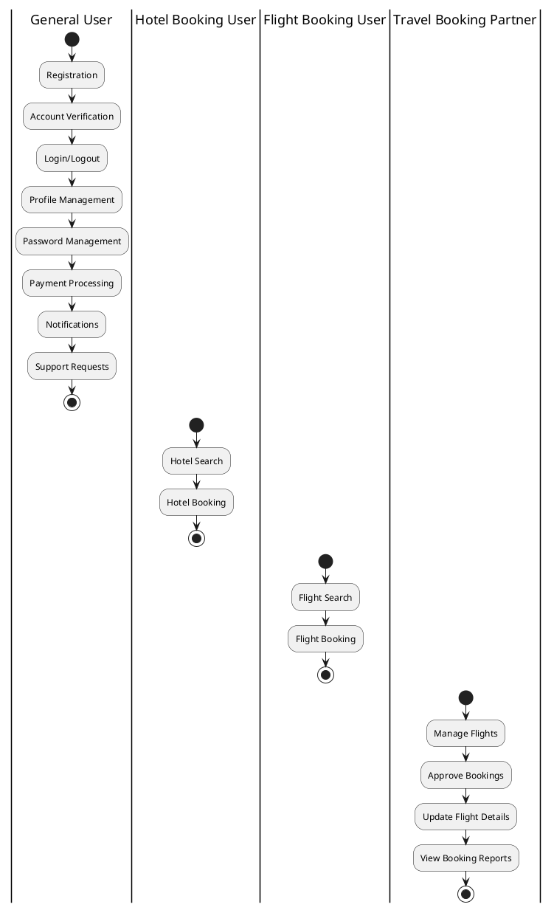

# Test Plan for MakeMyTrip  Competitor Platform

## 1. General User Features

### 1.1 Feature: User - Registration
#### Scenario: User creates a new account
**Given:**
The user is on the MakeMyTrip sign-up page.

**When:**
The user enters valid details (name, email, password, phone number).
The user clicks the "Sign Up" button.

**Then:**
- The user should be successfully signed up.
- The user should receive a confirmation email.
- The user should be redirected to the dashboard.

**Test Case:**
```javascript
describe('User Registration', function() {
  it('should allow user to sign up successfully', function() {
    signUpPage.open();
    signUpPage.enterDetails('John Doe', 'john.doe@example.com', 'password123', '9876543210');
    signUpPage.submitSignUp();
    expect(signUpPage.getConfirmationMessage()).to.include('Account created successfully');
  });
});
```

### 1.2 Feature: User - Account Verification
#### Scenario: User verifies their account via email
**Given:**
The user has successfully registered and received a verification email.

**When:**
The user clicks the verification link.

**Then:**
- The account should be successfully verified.
- The user should receive a confirmation message.

**Test Case:**
```javascript
describe('Account Verification', function() {
  it('should allow user to verify their account', function() {
    verificationPage.openLink('verification_code');
    expect(verificationPage.getVerificationStatus()).to.equal('verified');
  });
});
```

### 1.3 Feature: User - Login/Logout
#### Scenario: User logs in successfully
**Given:**
The user is on the login page.

**When:**
The user enters valid credentials and clicks the "Login" button.

**Then:**
- The user should be redirected to the dashboard.

**Test Case:**
```javascript
describe('User Login', function() {
  it('should allow user to log in with valid credentials', function() {
    loginPage.open();
    loginPage.enterCredentials('john.doe@example.com', 'password123');
    loginPage.submit();
    expect(dashboardPage.isLoggedIn()).to.be.true;
  });
});
```

### 1.4 Feature: User - Profile Management
#### Scenario: User updates profile details
**Given:**
The user is logged in and on the profile management page.

**When:**
The user updates their contact or payment details and submits.

**Then:**
- The profile should be updated successfully.

**Test Case:**
```javascript
describe('Profile Management', function() {
  it('should allow user to update their profile details', function() {
    profilePage.open();
    profilePage.updateDetails('Jane Doe', 'jane.doe@example.com', '9876543210');
    profilePage.saveChanges();
    expect(profilePage.getUpdateMessage()).to.include('Profile updated successfully');
  });
});
```

### 1.5 Feature: User - Password Management
#### Scenario: User resets their password
**Given:**
The user clicks the "Forgot Password" link on the login page.

**When:**
The user enters their email and resets the password.

**Then:**
- The password should be reset successfully.
- The user should receive a confirmation email.

**Test Case:**
```javascript
describe('Password Management', function() {
  it('should allow user to reset their password', function() {
    loginPage.open();
    loginPage.clickForgotPassword();
    resetPage.enterEmail('john.doe@example.com');
    resetPage.submit();
    expect(resetPage.getConfirmationMessage()).to.include('Password reset link sent');
  });
});
```

### 1.6 Feature: User - Payment Processing
#### Scenario: User makes a secure payment
**Given:**
The user has selected a service and proceeds to payment.

**When:**
The user enters valid payment details and confirms payment.

**Then:**
- The payment should be processed successfully.
- The user should receive a payment confirmation.

**Test Case:**
```javascript
describe('Payment Processing', function() {
  it('should process payment securely', function() {
    paymentPage.open();
    paymentPage.enterPaymentDetails('Credit Card', '4111111111111111', '12/25', '123');
    paymentPage.submitPayment();
    expect(paymentPage.getPaymentStatus()).to.include('Payment Successful');
  });
});
```

### 1.7 Feature: User - Notifications
#### Scenario: User receives notifications
**Given:**
The user has an active booking.

**When:**
The system sends booking updates or promotional offers.

**Then:**
- The user should receive notifications via email/SMS and in-app.

**Test Case:**
```javascript
describe('Notifications', function() {
  it('should deliver notifications to the user', function() {
    notificationSystem.triggerNotification('Booking Update', 'Your flight is delayed.');
    expect(notificationPage.getNotificationMessage()).to.include('Your flight is delayed.');
  });
});
```

### 1.8 Feature: User - Support Requests
#### Scenario: User creates a support ticket
**Given:**
The user accesses the support section.

**When:**
The user submits a ticket for an issue or query.

**Then:**
- The ticket should be created and tracked successfully.

**Test Case:**
```javascript
describe('Support Requests', function() {
  it('should allow user to create a support ticket', function() {
    supportPage.open();
    supportPage.createTicket('Issue with booking', 'I am unable to modify my booking.');
    expect(supportPage.getTicketStatus()).to.include('Ticket Created');
  });
});
```

---

## 2. Hotel Booking User Features

### 2.1 Feature: Hotel Search
#### Scenario: User searches for hotels
**Given:**
The user is logged in and on the hotel search page.

**When:**
The user enters valid search criteria (location, check-in/out dates, guests).

**Then:**
- Hotels matching the criteria should be displayed.

**Test Case:**
```javascript
describe('Hotel Search', function() {
  it('should display hotels based on search criteria', function() {
    hotelSearchPage.open();
    hotelSearchPage.enterSearchCriteria('New York', '2024-12-20', '2024-12-25', 2);
    expect(hotelSearchPage.getResultsCount()).to.be.above(0);
  });
});
```

### 2.2 Feature: Hotel Booking
#### Scenario: User books a hotel room
**Given:**
The user has selected a hotel room.

**When:**
The user enters guest details and completes payment.

**Then:**
- The booking should be confirmed, and the user should receive a confirmation email.

**Test Case:**
```javascript
describe('Hotel Booking', function() {
  it('should allow user to book a hotel room', function() {
    hotelBookingPage.open();
    hotelBookingPage.selectRoom('Deluxe Room');
    hotelBookingPage.enterGuestDetails('John Doe', 'john.doe@example.com');
    hotelBookingPage.completePayment('Credit Card', '4111111111111111', '12/25', '123');
    expect(hotelBookingPage.getConfirmationMessage()).to.include('Booking Confirmed');
  });
});
```

---

## 3. Flight Booking User Features

### 3.1 Feature: Flight Search
#### Scenario: User searches for flights
**Given:**
The user is logged in and on the flight search page.

**When:**
The user enters valid search criteria (departure, arrival, dates, passengers).

**Then:**
- Flights matching the criteria should be displayed.

**Test Case:**
```javascript
describe('Flight Search', function() {
  it('should display flights based on search criteria', function() {
    flightSearchPage.open();
    flightSearchPage.enterSearchCriteria('New York', 'Los Angeles', '2024-12-20', 1);
    expect(flightSearchPage.getResultsCount()).to.be.above(0);
  });
});
```

### 3.2 Feature: Flight Booking
#### Scenario: User books a flight
**Given:**
The user has selected a flight.

**When:**
The user enters passenger details and completes payment.

**Then:**
- The booking should be confirmed, and the user should receive a confirmation email.

**Test Case:**
```javascript
describe('Flight Booking', function() {
  it('should allow user to book a flight', function() {
    flightBookingPage.open();
    flightBookingPage.selectFlight('AI101');
    flightBookingPage.enterPassengerDetails('John Doe');
    flightBookingPage.completePayment('Credit Card', '4111111111111111', '12/25', '123');
    expect(flightBookingPage.getConfirmationMessage()).to.include('Booking Confirmed');
  });
});
```

---

## 4. Travel Booking Partner Features

### 4.1 Feature: Manage Flights
#### Scenario: Partner adds a new flight
**Given:**
The travel partner is logged in and on the flight management page.

**When:**
The partner enters flight details and submits the form.

**Then:**
- The new flight should be added successfully.

**Test Case:**
```javascript
describe('Add New Flight', function() {
  it('should allow partner to add a new flight', function() {
    flightManagementPage.open();
    flightManagementPage.addFlight('AI102', 'New York', 'Chicago', '2024-12-21', '10:00 AM', '12:00 PM', 200);
    expect(flightManagementPage.getConfirmationMessage()).to.include('Flight Added Successfully');
  });
});
```

### 4.2 Feature: Approve Bookings
#### Scenario: Partner approves a booking
**Given:**
The travel partner has received a booking request.

**When:**
The partner approves the booking.

**Then:**
- The booking status should be updated to "Approved."

**Test Case:**
```javascript
describe('Approve Booking', function() {
  it('should allow partner to approve a booking', function() {
    bookingManagementPage.open();
    bookingManagementPage.selectBooking('BK12345');
    bookingManagementPage.approveBooking();
    expect(bookingManagementPage.getBookingStatus()).to.equal('Approved');
  });
});
```

### 4.3 Feature: Update Flight Details
#### Scenario: Partner updates flight information
**Given:**
The travel partner is on the flight management page.

**When:**
The partner modifies existing flight details and submits the update.

**Then:**
- The flight details should be updated successfully.

**Test Case:**
```javascript
describe('Update Flight Details', function() {
  it('should allow partner to update flight details', function() {
    flightManagementPage.open();
    flightManagementPage.updateFlight('AI102', { departureTime: '11:00 AM', price: 250 });
    expect(flightManagementPage.getUpdateMessage()).to.include('Flight Details Updated');
  });
});
```

### 4.4 Feature: View Booking Reports
#### Scenario: Partner views a report of bookings
**Given:**
The travel partner is logged in.

**When:**
The partner navigates to the booking reports section.

**Then:**
- A detailed report of bookings should be displayed.

**Test Case:**
```javascript
describe('View Booking Reports', function() {
  it('should allow partner to view booking reports', function() {
    bookingReportsPage.open();
    expect(bookingReportsPage.getReportsCount()).to.be.above(0);
  });
});
```


---

## 5. Non-Functional Requirements (NFRs)

To ensure the MakeMyTrip platform delivers a high-quality experience, we have outlined test scenarios for the following non-functional requirements: Performance, Usability, Security, Reliability, and Maintainability.

---

### 5.1 Performance

This section evaluates the platform's efficiency and responsiveness under various conditions.

| Test Scenario                             | Description                                                                 | Success Criteria                                                                 | Testing Tools/Methodology                            |
|-------------------------------------------|-----------------------------------------------------------------------------|---------------------------------------------------------------------------------|-----------------------------------------------------|
| Response time under normal and peak loads | Measure how quickly the platform responds during login, search, and booking.| Response time should be less than 2 seconds for 95% of interactions.           | Use Apache JMeter, Locust for load testing.         |
| Scalability with increased user base      | Simulate up to 10,000 concurrent users to assess the system's scalability.  | The system should handle the load without crashing or significant performance degradation. | Perform stress testing using cloud-based load simulators. |
| Flight search results latency             | Evaluate the time taken to fetch flight search results.                     | Search results should appear within 3 seconds for 95% of queries.              | Implement API response monitoring tools like Postman. |
| Database query performance                | Measure database query execution time during peak operations.               | Queries should execute within 500ms for 90% of transactions.                   | Use tools like New Relic or Dynatrace.              |

---

### 5.2 Usability

This section focuses on user-friendliness and ease of interaction.

| Test Scenario                              | Description                                                                  | Success Criteria                                                            | Testing Tools/Methodology                   |
|--------------------------------------------|------------------------------------------------------------------------------|----------------------------------------------------------------------------|----------------------------------------------|
| Ease of navigation                         | Assess the intuitiveness of the user interface (UI).                         | Users should be able to navigate to their desired feature in ≤3 clicks.   | Perform heuristic evaluations and A/B testing. |
| Accessibility for differently-abled users  | Ensure compatibility with screen readers and other assistive technologies.   | Compliance with WCAG 2.1 AA standards.                                   | Use WAVE and Axe Accessibility Checker.        |
| Consistent UI and UX                       | Validate that the platform maintains a uniform design and experience across pages. | Users should find the interface consistent and free from visual anomalies. | Conduct user surveys and usability testing.     |
| Mobile responsiveness                      | Test usability on devices of varying screen sizes (mobile, tablet, desktop).  | UI should adapt seamlessly to all screen sizes without breaking.          | Use BrowserStack or LambdaTest.               |

---

### 5.3 Security

This section ensures that the platform protects user data and mitigates potential risks.

| Test Scenario                 | Description                                                                 | Success Criteria                                                                    | Testing Tools/Methodology          |
|-------------------------------|-----------------------------------------------------------------------------|-----------------------------------------------------------------------------------|------------------------------------|
| Data encryption               | Ensure sensitive data (e.g., passwords, payment info) is encrypted at rest and in transit. | All sensitive data should be encrypted using AES-256 or TLS 1.2/1.3.             | Use Wireshark or Burp Suite.       |
| Authentication and authorization | Validate secure login and role-based access control (RBAC).             | Unauthorized users should be unable to access restricted areas.                  | Perform penetration testing with OWASP ZAP. |
| Vulnerability assessment      | Identify and mitigate potential vulnerabilities in the codebase.          | No high-severity vulnerabilities should remain unresolved.                       | Use tools like Nessus or Qualys.   |
| Security against injections   | Test for SQL injection, XSS, and CSRF vulnerabilities.                    | The system should reject malicious payloads and maintain integrity.              | Conduct automated testing with Acunetix. |

---

### 5.4 Reliability

This section assesses the system's dependability under normal and stress conditions.

| Test Scenario                     | Description                                                         | Success Criteria                                                              | Testing Tools/Methodology        |
|-----------------------------------|---------------------------------------------------------------------|------------------------------------------------------------------------------|----------------------------------|
| Uptime and availability           | Test the platform's uptime under continuous operations.            | Ensure 99.9% uptime as per SLA.                                              | Use Pingdom or UptimeRobot.      |
| Failure recovery time             | Measure the time to recover from a system failure.                 | Recovery time should not exceed 5 minutes for critical services.             | Perform failover testing.        |
| Data consistency after failures   | Validate the consistency of data after unexpected crashes.         | Data should remain accurate and complete post-recovery.                      | Conduct crash recovery testing.  |
| Error handling                    | Ensure graceful handling of unexpected errors.                     | Users should see informative error messages instead of system crashes.       | Perform fault injection testing. |

---

### 5.5 Maintainability

This section evaluates the platform's ease of maintenance and adaptability to changes.

| Test Scenario                       | Description                                                         | Success Criteria                                                                    | Testing Tools/Methodology       |
|-------------------------------------|---------------------------------------------------------------------|------------------------------------------------------------------------------------|----------------------------------|
| Code readability and documentation  | Check if the codebase is clean and well-documented.                | Developers should understand and modify code with minimal ramp-up time.           | Perform code reviews and audits. |
| Modular architecture                | Validate that the system follows modular design principles.        | New features should integrate easily without affecting existing modules.          | Analyze system design diagrams.  |
| Dependency updates                  | Test the ability to update external dependencies (e.g., libraries, APIs). | Updates should be applied without breaking functionality.                         | Conduct compatibility testing.   |
| Automated testing coverage          | Ensure robust automated test coverage for critical modules.        | ≥90% of critical functionality should have automated test coverage.               | Use Jest, Mocha, or Selenium.    |

---

## 6. Swimlane Diagram 


Code


---

## 7. Conclusion

The test plan for the MakeMyTrip platform ensures that all critical functionalities related to user, admin, and travel partner features are thoroughly tested. By covering both positive and negative scenarios, we aim to validate the platform’s stability, usability, and performance. The integration of all features and their seamless execution is essential to provide users with a smooth and efficient experience while interacting with the system.

- **Test Coverage:**  
  - User Sign Up/Sign In
  - Flight Search, Booking, and Cancellation
  - Admin functionalities for managing bookings and flight listings
  - Travel partner flight management
  - General profile management features
  
The test cases defined in this document serve as a solid foundation for identifying issues early in the development lifecycle, ensuring quality and reliability in the final release.

---

