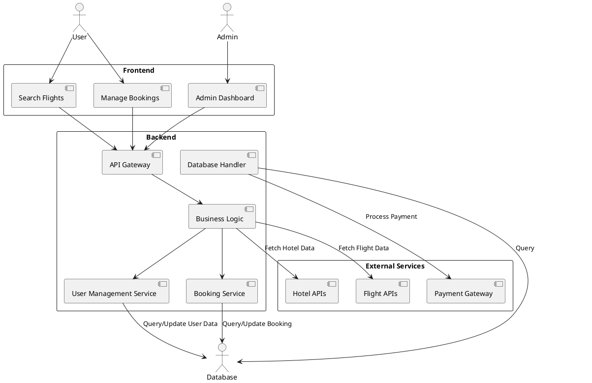
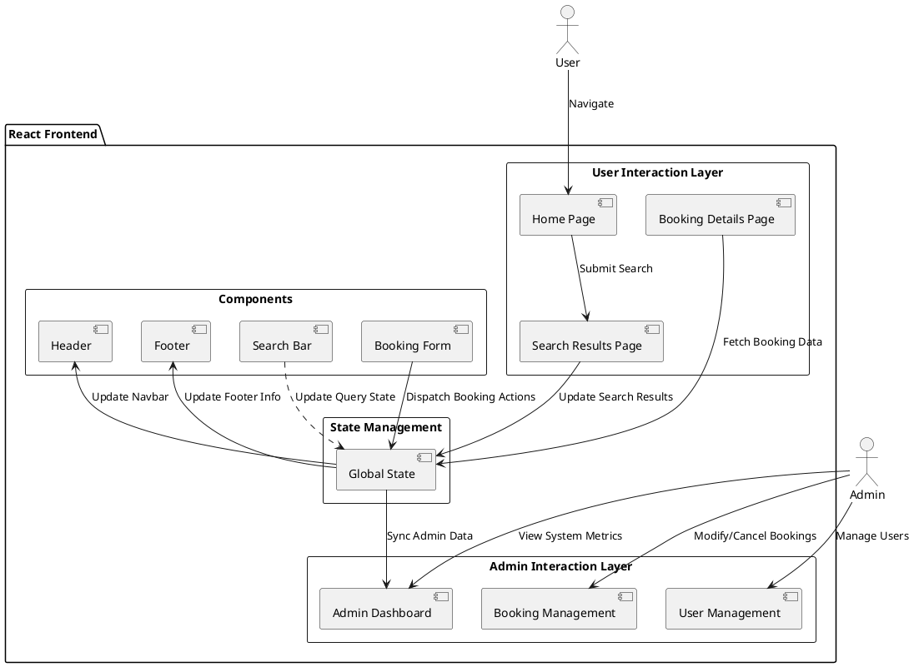
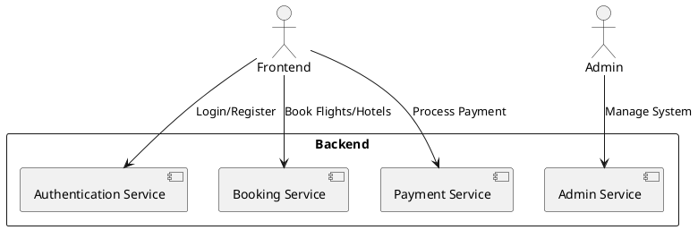
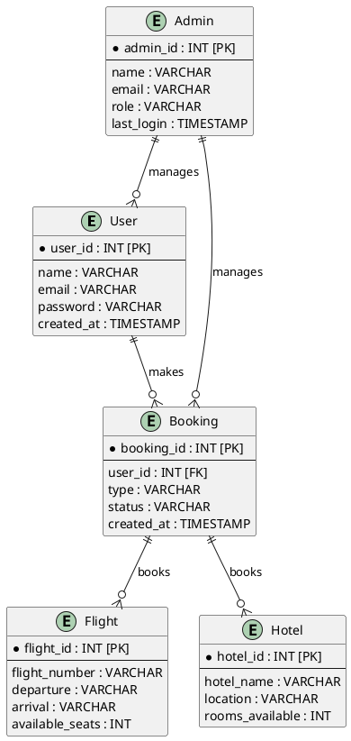

# Design Document for Make My Trip Clone

## Table of Contents

1. [Introduction](#introduction)
2. [Features Overview](#features-overview)
3. [System Architecture](#system-architecture)
   - [Diagram 1: Overall System Architecture](#diagram-1-overall-system-architecture)
4. [Frontend Architecture](#frontend-architecture)
   - [Diagram 2: Frontend Architecture](#diagram-2-frontend-architecture)
5. [Backend Architecture](#backend-architecture)
   - [Diagram 3: Backend Architecture](#diagram-3-backend-architecture)
6. [Database Design](#database-design)
   - [Diagram 4: Database Schema](#diagram-4-database-schema)
7. [Design Considerations](#design-considerations)
8. [PlantUML Code for Diagrams](#plantuml-code-for-diagrams)

---

## 1. Introduction

This document outlines the comprehensive system design for the **Make My Trip Clone** application. The application replicates core functionalities of the Make My Trip platform, including booking flights, hotels, and cabs, managing user profiles, and offering notifications for important updates like bookings, cancellations, and offers.

The design focuses on scalability, modularity, performance optimization, and a seamless user experience. This document includes architectural diagrams and explanations for the frontend, backend, database, and notification system.

---

## 2. Features Overview

Key features of the Make My Trip Clone include:
- **Flight Booking**: Users can search for flights based on their source, destination, and travel dates.
- **Hotel Booking**: Search for hotels, view room availability, and book stays.
- **Cab Booking**: Book cabs for airport pickups/drop-offs or intercity travel.
- **User Profiles**: Manage personal information, preferences, and saved trips.
- **Notifications**: Real-time updates about bookings, cancellations, discounts, and promotions.
- **Payment Gateway**: Secure integration with payment systems for seamless transactions.
- **Admin Panel**: Manage listings, bookings, and promotional offers.

---

## 3. System Architecture

The **Make My Trip Clone** adopts a distributed system architecture to handle a large volume of traffic and ensure scalability. The system includes the following key layers:
1. **Frontend**: User interface for interacting with the platform.
2. **Backend**: Manages API requests, business logic, and integrations.
3. **Database**: Stores relational data for users, bookings, and listings.

### Diagram 1: Overall System Architecture

---

## 4. Frontend Architecture

### Overview

The frontend is built as a **Single Page Application (SPA)** using modern web development tools:
- **React.js**: Modular and reusable components.
- **Redux/Context API**: Efficient state management.
- **Tailwind CSS**: For responsive and scalable design.
- **React Router**: Handles navigation without page reloads.

**Frontend Responsibilities**:
1. Providing a dynamic, interactive UI for users.
2. Handling user input and dispatching API requests.
3. Rendering real-time notifications from the backend.

### Diagram 2: Frontend Architecture

---

## 5. Backend Architecture

### Overview

The backend is designed as a **microservices-based system** using **Node.js** and the **Hono** serverless framework. It handles:
1. API routing and request validation.
2. Business logic for bookings, cancellations, and notifications.
3. Interfacing with the database and third-party APIs.

**Key Features**:
- **Scalability**: Serverless architecture ensures easy scaling.
- **Secure Authentication**: User sessions managed via JWT tokens.

### Diagram 3: Backend Architecture

---

## 6. Database Design

### Overview

The database is designed to be highly normalized and optimized for relational data. **PostgreSQL** is used, with the following major tables:
- **Users**: Stores user credentials and preferences.
- **Flights**: Information about airlines, schedules, and pricing.
- **Hotels**: Hotel details, room availability, and pricing.
- **Bookings**: Links users with their reservations (flights, hotels, or cabs).

### Diagram 4: Database Schema

---

## 7. Design Considerations

### Scalability
- **Horizontal Scaling**: Add more nodes to handle increased traffic.
- **Database Sharding**: Split large tables for improved query performance.

### Security
- **OAuth 2.0 Integration**: Enable secure third-party logins.
- **Encryption**: Encrypt sensitive data like passwords and payment details.

### Performance Optimization
- **Caching**: Use Redis or Memcached for frequently accessed data.
- **CDN Integration**: Deliver frontend assets quickly across geographies.

### Reliability
- **Event Sourcing**: Track all events (bookings, cancellations) to recover in case of failure.
- **Monitoring and Alerts**: Set up tools like Prometheus and Grafana for real-time monitoring.

---
