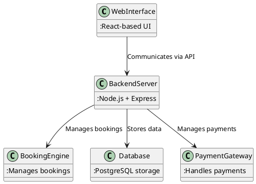

# Make My Trip Clone 🚀

## Table of Contents  
- [Introduction](#introduction)  
- [Vision Statement](#vision-statement)  
- [Core Features](#core-features)  
- [Project Scope](#project-scope)  
- [Methodology](#methodology)  
- [Technical Architecture](#technical-architecture)  
- [Technology Stack](#technology-stack)  
- [Future Enhancements](#future-enhancements)  
- [References & Inspiration](#references--inspiration)  

---

## Introduction  

The "Make My Trip Clone" is a comprehensive travel booking platform designed to simplify trip planning and booking for travelers worldwide. It integrates flights, hotels, car rentals, and holiday packages into a unified experience. With intuitive navigation, personalized options, and robust support features, it aims to become the ultimate tool for modern travelers.

### Objectives  
- Provide a seamless, user-friendly platform for travel planning and booking.  
- Integrate core services like flights, hotels, and car rentals under one system.  
- Enhance customer satisfaction through personalization and efficient support.  
- Ensure secure transactions with advanced payment options and encryption.  

---

## Vision Statement  

> "To build a comprehensive and user-friendly travel booking platform that simplifies trip planning while providing flexible options and excellent customer support."

Our mission is to replicate and elevate the functionalities of top travel platforms, offering cutting-edge features tailored to the needs of contemporary travelers.

---

## Core Features  

### 1. User Management System 👥  

- **Multi-Channel Registration and Login**:  
  - Users can sign up or log in via email, phone, Google, or Facebook.  
  - Support for OTP-based authentication and secure password hashing (bcrypt).  

- **Profile Management**:  
  - Update personal details and travel preferences.  
  - Manage saved payment methods and past bookings.  

- **Password Recovery**:  
  - Enable account recovery through secure links or OTP verification.  

---

### 2. Flight Booking ✈️  

- **Advanced Search**:  
  - Search for flights by destination, travel dates, and passenger count.  
  - Filter by airlines, stops, duration, and ticket class.  

- **Real-Time Pricing and Availability**:  
  - View updated ticket prices and live seat availability.  

- **Customizable Options**:  
  - Add baggage, select seats, and purchase travel insurance.  

- **Multi-City and Round Trip Bookings**:  
  - Plan complex itineraries across multiple destinations.  

---

### 3. Hotel Booking 🏨  

- **Detailed Filters**:  
  - Search hotels by price, amenities, guest ratings, and location proximity.  

- **Room Options**:  
  - Book single or multiple rooms and choose room upgrades.  

- **Wishlist**:  
  - Save preferred hotels for future planning.  

- **Dynamic Pricing**:  
  - Offers and discounts based on demand and seasonality.  

---

### 4. Holiday Packages 🌍  

- **Predefined Packages**:  
  - Select from curated options for honeymoons, family vacations, and adventure trips.  

- **Customizable Itineraries**:  
  - Add activities, upgrade accommodations, or personalize packages.  

- **Group Discounts**:  
  - Special pricing for family or corporate travel.  

---

### 5. Bus and Train Booking 🚍🚆  

- **Route Search**:  
  - Find buses and trains for intercity and regional travel.  

- **Seat Preferences**:  
  - Choose seating preferences like window or aisle.  

- **Real-Time Availability**:  
  - Book tickets based on live seat availability.  

---

### 6. Car Rentals 🚗  

- **Flexible Rental Options**:  
  - Rent SUVs, sedans, or hatchbacks with or without a driver.  

- **Add-ons**:  
  - Add GPS, child seats, or other custom services.  

- **Provider Details**:  
  - View terms, conditions, and ratings of rental companies.  

---

### 7. Payment Gateway 💳  

- **Multiple Payment Methods**:  
  - Accept payments via credit/debit cards, UPI, net banking, and wallets.  

- **EMI Support**:  
  - Offer installment options for high-value bookings.  

- **Secure Transactions**:  
  - PCI-DSS compliance and encrypted payment gateways.  

---

### 8. Booking Management 📋  

- **Unified Dashboard**:  
  - Manage all bookings, past trips, and upcoming schedules.  

- **Modification and Cancellation**:  
  - Adjust trip details or cancel bookings with clear refund policies.  

- **Notifications**:  
  - Alerts for schedule changes and booking updates.  

---

### 9. Customer Support 🤝  

- **Real-Time Chat and Support Tickets**:  
  - Offer instant help and detailed ticket tracking.  

- **Knowledge Base**:  
  - Comprehensive FAQs and troubleshooting guides.  

- **Multi-Language Support**:  
  - Provide customer service in English and other languages (future scope).  

---

## Project Scope  

### Included Features 🎯  
1. Full-service travel booking platform: flights, hotels, and packages.  
2. Intuitive design and responsive interface.  
3. Unified booking management.  
4. Secure payment systems.  
5. Personalized recommendations.  

### Excluded Features ⛔  
1. Multi-language support (current version supports English only).  
2. Visa assistance services.  
3. Real-time flight tracking integration.  
4. Blockchain-based payments.  

---

## Methodology  

The project follows the **Agile Development Methodology**, ensuring iterative updates and stakeholder involvement.

### Key Phases  
1. **Requirements Gathering**:  
   - Analyze user needs and define functional requirements.  

2. **Planning and Design**:  
   - Create detailed wireframes and workflows.  

3. **Development**:  
   - Frontend with React.js.  
   - Backend with Node.js and Express.  

4. **Testing**:  
   - Conduct unit, integration, and load testing.  

5. **Deployment**:  
   - Deploy on AWS or GCP with CI/CD pipelines.  

6. **Maintenance**:  
   - Monitor feedback and improve features post-launch.  

---

## Technical Architecture  

Here’s a high-level architecture diagram of the platform:  

#### Code

## Technology Stack  

- **Frontend**: React.js for web interface, React Native for mobile apps.  
- **Backend**: Node.js and Express for API development.  
- **Database**: PostgreSQL for reliable data storage.  
- **APIs**: Google Maps for location services, Stripe for payments.  

---

## Future Enhancements  

1. **AI Recommendations**: Personalized trip suggestions based on preferences.  
2. **Advanced Filters**: Enhanced sorting by ratings, deals, and amenities.  
3. **Global Language and Currency Support**: Expand reach to international users.  
4. **Offline Booking Mode**: Enable pre-booking with offline sync.  

---
