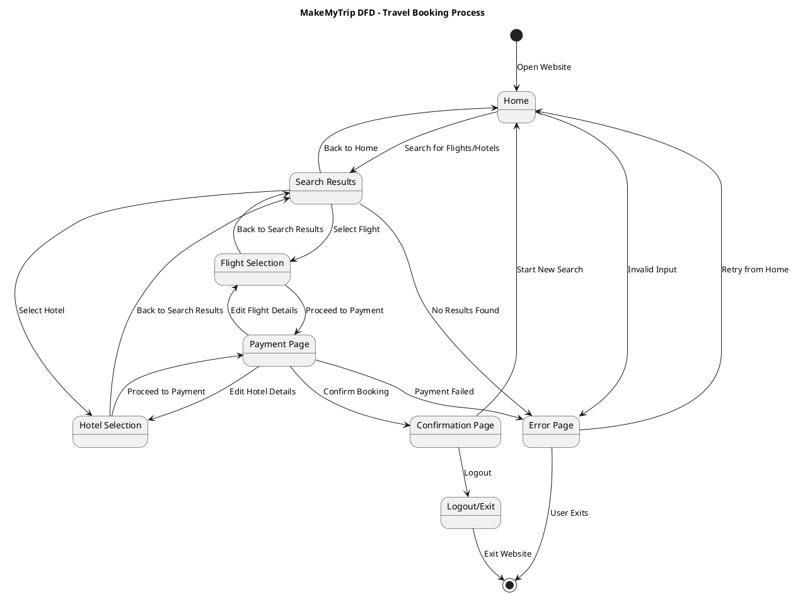

# **DFD-make my trip**

## Explanation of the Data Flow Diagram (DFD)

The following Data Flow Diagram (DFD) represents the workflow of a MakeMyTrip clone, a travel booking platform. It models the step-by-step interactions a user might have with the website, showcasing the transitions between different states during the booking process.

## Key Highlights of the DFD:

---

### 1. Initial State:
The process begins when a user lands on the **Home page**, representing the website's entry point.

---

### 2. User Journey:
From the Home page, the user can:
- **Search for flights or hotels.**
- **Navigate to the Search Results page** to view available options.

Upon selecting an option, the user progresses to either:
- **Flight Selection:** For booking a flight.
- **Hotel Selection:** For booking accommodation.

---

### 3. Payment and Confirmation:
After selecting a flight or hotel, the user moves to the **Payment Page** to provide payment details. 

- **Successful payment** transitions the user to the **Confirmation Page**, where the booking is finalized.

---

### 4. Error Handling:
The DFD incorporates error handling for scenarios like:
- **Invalid input on the Home page.**
- **No results found** during a search.
- **Payment failures.**

In such cases, the user is redirected to an **Error Page** with options to retry or exit the website.

---

### 5. Completion:
After confirmation, the user can log out, completing the process, or return to the **Home page** to start a new search.

---

## Purpose of the DFD:

This DFD serves as a visual representation of the user experience on the platform. It helps in:
- **Understanding the logical flow of user interactions.**
- **Identifying potential error points and their resolutions.**
- **Planning and implementing the core functionalities of a travel booking system.**

The diagram is detailed enough to cover all critical user actions and transitions, making it a valuable tool for developers and stakeholders to design and improve the platform efficiently.
